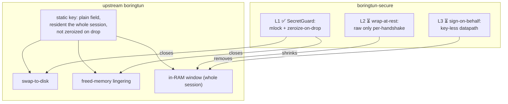

# Security hardening — `boringtun-secure`

`boringtun-secure` is a security-hardened fork of [cloudflare/boringtun](https://github.com/cloudflare/boringtun)
focused on a single thing the upstream library does not address: **how long, and how exposed, the
WireGuard static private key is in process memory.**

It stays API-compatible with upstream (the WireGuard handshake math is byte-for-byte identical — the
upstream handshake test-suite passes unchanged), and stays on the same **BSD-3-Clause** license.

## The problem

A WireGuard datapath needs the static private key resident in memory to perform the handshake's
Diffie-Hellman operations. In upstream boringtun the key (`x25519_dalek::StaticSecret`) is held as a
plain field for the **entire lifetime of the tunnel**, and `StaticSecret` — while it can be zeroized —
does **not** zeroize on drop. That leaves three recovery vectors:

1. **Swap to disk** — the key's page can be paged out to swap and persist on disk.
2. **Freed-memory lingering** — when the tunnel is dropped, the key bytes are left in the freed heap.
3. **In-RAM window** — for the whole session a live memory dump (or cold-boot read) finds the raw key.

## L1 — `SecretGuard` (done)

The static private key is wrapped in a `SecretGuard` that:

- **Boxes** the key, giving it a stable heap address (so locking/zeroizing targets a fixed page, not a
  value Rust may move).
- **`mlock`s** that page, so the key is never written to swap/disk → closes **vector 1**.
- **Zeroizes and `munlock`s on drop**, so the key never lingers in freed memory → closes **vector 2**.

`SecretGuard` `Deref`s to the inner `StaticSecret`, so every handshake call site (`diffie_hellman`,
`PublicKey::from`) is unchanged — which is why the upstream handshake tests still pass byte-for-byte.
The `mlock` is best-effort: if it fails (e.g. `RLIMIT_MEMLOCK` is too low for an unprivileged process)
the datapath keeps working and the zeroize-on-drop guarantee still holds.

## L2 — wrap-at-rest (planned)

Store the static key **encrypted under an ephemeral, in-memory key**, and unwrap it only for the brief
Diffie-Hellman during a handshake. WireGuard rekeys roughly every two minutes, so the raw key would be
resident for a few milliseconds per rekey instead of the whole session — a large cut to **vector 3**.
The static key is used in only a handful of DH sites, all reachable through `SecretGuard`, so L2 replaces
its `Deref` with a `with_unwrapped(|secret| …)` accessor.

## L3 — sign-on-behalf (planned, strongest)

Keep the key out of the datapath entirely: a separate **signer process** holds it and performs the
handshake's two static-key DH operations on request; the datapath holds only a handle. A compromise of
the datapath process then never yields the key. This removes **vector 3** from the datapath at the cost
of a small signer protocol (two `X25519(priv, peer_pub)` calls over a peer-credential-gated socket).

## Compatibility

- Drop-in for `boringtun` 0.7.x — same public API, same crate layout, `BSD-3-Clause`.
- The handshake is unchanged: `cargo test -p boringtun` (the upstream noise/handshake suite) passes.
- Pin it as a git dependency:
  `boringtun = { git = "https://github.com/GeiserX/boringtun-secure", branch = "main" }`.
