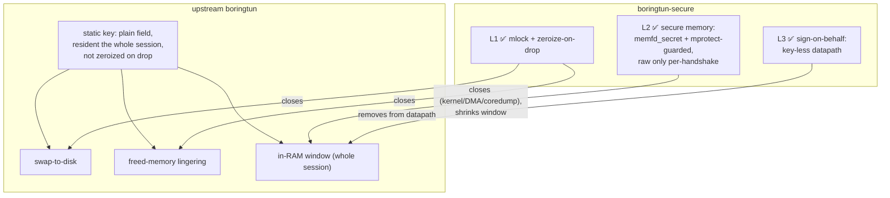

# Security hardening — `boringtun-secure`

`boringtun-secure` is a security-hardened fork of [cloudflare/boringtun](https://github.com/cloudflare/boringtun)
focused on a single thing the upstream library does not address: **how long, and how exposed, the
WireGuard static private key is in process memory.**

It stays API-compatible with upstream (the WireGuard handshake math is byte-for-byte identical — the
upstream handshake test-suite passes unchanged), and stays on the same **BSD-3-Clause** license.

## The problem

A WireGuard datapath needs the static private key resident in memory to perform the handshake's
Diffie-Hellman operations. In upstream boringtun the key (`x25519_dalek::StaticSecret`) is held as a
plain field for the **entire lifetime of the tunnel**, and `StaticSecret` — while it can be zeroized —
does **not** zeroize on drop. That leaves three recovery vectors:

1. **Swap to disk** — the key's page can be paged out to swap and persist on disk.
2. **Freed-memory lingering** — when the tunnel is dropped, the key bytes are left in the freed heap.
3. **In-RAM window** — for the whole session a live memory dump (or cold-boot read) finds the raw key.

## L1 — `SecretGuard` (done)

The static private key is wrapped in a `SecretGuard` that:

- **Boxes** the key, giving it a stable heap address (so locking/zeroizing targets a fixed page, not a
  value Rust may move).
- **`mlock`s** that page, so the key is never written to swap/disk → closes **vector 1**.
- **Zeroizes and `munlock`s on drop**, so the key never lingers in freed memory → closes **vector 2**.

`SecretGuard` `Deref`s to the inner `StaticSecret`, so every handshake call site (`diffie_hellman`,
`PublicKey::from`) is unchanged — which is why the upstream handshake tests still pass byte-for-byte.
The `mlock` is best-effort: if it fails (e.g. `RLIMIT_MEMLOCK` is too low for an unprivileged process)
the datapath keeps working and the zeroize-on-drop guarantee still holds.

> **Note:** L2 below now supersedes L1's `Box`+`Deref` storage with guarded secure memory and a
> `with_key()` accessor. L1's guarantees (no swap, zeroize-on-drop) are subsumed and strengthened.

## L2 — secure memory (done)

Instead of obfuscating the key with a co-resident wrapping key (which a memory dump trivially
reconstructs), the 32 scalar bytes live in the **most protected memory the platform offers**, made
readable **only** for the brief Diffie-Hellman during a handshake (`mprotect(PROT_NONE)` at rest). This
is the libsodium guarded-memory model.

- **Linux** — `memfd_secret(2)` (kernel 5.14+): the page is mapped only in *this* process's page tables
  and **removed from the kernel direct map**, so the key is invisible to the kernel, to other processes,
  to DMA, to coredumps and to swap. If `memfd_secret` is unavailable (old kernel, `secretmem.enable=0`,
  seccomp), it **fails closed to an anonymous `mmap` + `mlock`** — never breaking the datapath.
- **Other Unix (macOS/iOS)** — an `mlock`'d anonymous page, `mprotect`-guarded the same way.
- All platforms — the key is wiped (and the page restored to writable) on drop.

The static key is reached only through `SecretGuard::with_key(|sk| …)` (no `Deref`): it opens the read
window, hands the closure a transient `StaticSecret` reconstructed from the bytes, then zeroizes that
transient and re-protects the page. The `to_bytes()`/`from()` round-trip is x25519-clamping-idempotent,
so the handshake math is byte-for-byte identical — **the upstream handshake test-suite proves it**. The
raw key is therefore in ordinary memory only for ~microseconds per rekey (~every two minutes), not the
whole session.

## L3 — sign-on-behalf (done, strongest)

Keep the key out of the datapath **process** entirely. The handshake's only static-key operation —
`DH(static_private, peer_public)` — is performed through a `StaticKeyAgent` trait. The default agent
holds the key in L2 guarded memory; for a key-less datapath, inject a different agent via
`Tunn::new_with_agent`:

- **`signer::serve_stream`** runs in a small **signer process** that holds the key (in the same L2
  guarded memory, via `default_agent`) and answers `DH(static_private, peer_public)` over a unix socket,
  authorizing the caller by `SO_PEERCRED` (`signer::peer_uid`).
- **`signer::SignerClient`** is the datapath-side agent: it holds **only the socket and the (public)
  static public key** — never the private key. A compromise of the datapath process therefore never
  yields the key; it lives in a different process.

A test (`a_handshake_completes_with_the_static_key_held_only_by_a_signer`) completes a real WireGuard
handshake with the responder's key held only by the signer over a socket — the datapath `Tunn` never
receives it. Wire protocol: the client writes 32 bytes (the peer public key), the signer replies with 32
bytes (the DH output); the static public key is never sent (it is public).

**Why a signer and not hardware:** WireGuard uses **Curve25519**, which mainstream secure hardware does
**not** do — Apple's Secure Enclave is **P-256 only** (even on current hardware), and most TPMs lack
Curve25519. So the raw key must live in *some* process's RAM at handshake time; the signer makes that a
minimal, defensible process rather than the datapath. (A hardware token — YubiKey / OpenPGP card — *can*
do on-card X25519, but requires a physical device not present on headless servers.)

## Honest limits

No userspace scheme defeats a **physical DRAM cold-boot** (the bytes are still in DRAM while in use) or a
**debugger / `ptrace` on the key-holding process itself** — those need hardware memory encryption
(AMD SME / Intel TME, key held in the CPU) or a secure element that does X25519 (which does not exist for
Curve25519). What L1–L3 *do* close: swap, freed-memory lingering, kernel/DMA/coredump reads, and — by
keeping the page `PROT_NONE` except during the DH — the continuous-residency window that an opportunistic
one-shot memory scrape relies on. The debugger/`ptrace` case is the embedding application's to bound
(e.g. running the datapath as a separate, locked-down uid).

## Compatibility

- Drop-in for `boringtun` 0.7.x — same public API, same crate layout, `BSD-3-Clause`.
- The handshake is unchanged: `cargo test -p boringtun` (the upstream noise/handshake suite) passes.
- Pin it as a git dependency:
  `boringtun = { git = "https://github.com/GeiserX/boringtun-secure", branch = "main" }`.
